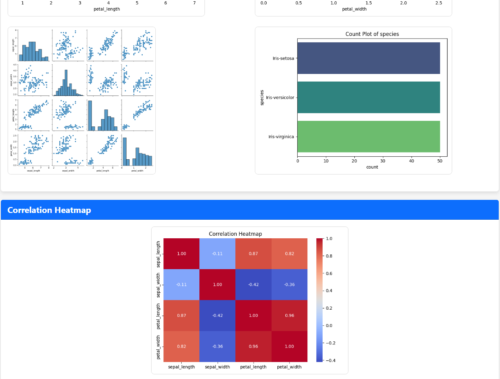

# Data Analysis and Model Performance Visualization

This repository showcases a comprehensive data analysis and machine learning model performance visualization web application. The project leverages various data science techniques to generate insightful visualizations and performance metrics of multiple models. The goal of this application is to provide users with an intuitive interface to explore datasets, view exploratory data analysis (EDA) results, and evaluate model performance.

## Features

- **Data Summary**: Displays key statistics of the dataset.
- **Exploratory Data Analysis (EDA)**: Visualizes the dataset's distribution through histograms, boxplots, and correlation heatmaps.
- **Model Evaluation**: Visualizes the performance of machine learning models, including confusion matrices and performance metrics.
- **Model Comparison**: Displays a comparison of different models using various evaluation metrics.
- **Downloadable Reports**: Users can download a comprehensive PDF report that summarizes the analysis and results.
- **Web Interface**: Easy-to-use interface for uploading datasets and exploring results.

## Screenshots

### 1. **Dataset Upload Page**
The landing page where users can upload their CSV dataset.


### 2. **Data Summary Section**
Displays an overview of key statistics for the uploaded dataset.


### 3. **Exploratory Data Analysis (EDA)**
Visualizes the dataset's distribution and relationships between features using histograms, boxplots, and correlation heatmaps.




### 4. **Model Performance Evaluation**
Shows confusion matrices and performance metrics for various models.


### 5. **Model Comparison Chart**
Compares the performance of different models side by side.


### 6. **Download Report**
Download a comprehensive PDF report with all analysis and visualizations.


## Installation

To set up this project locally, follow the steps below:

### Prerequisites

- Python 3.7+
- pip (Python package installer)

### Step-by-Step Installation

1. Clone the repository:

   ```bash
   git clone https://github.com/prince41773/Data-Analysis-and-Model-Performance-Visualization.git
   ```
2. Install the required dependencies:
   ```bash
   pip install -r requirements.txt
   ```
3. Run the Flask web application:
   ```bash
   python app.py
   ```
4. Open the application in your browser at 'http://127.0.0.1:5000'.

## Usage

### Uploading a Dataset
1. Visit the home page of the application.
2. Upload a CSV dataset containing your data by clicking the "Choose File" button and selecting a `.csv` file from your local machine.
3. After uploading, the application will automatically process the dataset and display various analysis results, including EDA visualizations, model evaluation metrics, and a downloadable report.

### Viewing Results
After uploading a dataset, you will be presented with:

- **Data Summary**: Key statistics such as mean, median, and standard deviation for each feature.
- **Exploratory Data Analysis (EDA)**: Visualizations such as histograms and boxplots that provide insights into the distribution and relationships of the data.
- **Model Results**: Performance metrics (accuracy, precision, recall, etc.) for multiple machine learning models.
- **Confusion Matrices**: Visual representation of model performance on test data.
- **Model Comparison**: A chart that compares the performance of different models.

### Downloading the Report
Once the analysis is complete, you can download a detailed PDF report containing:

- Data summary
- EDA visualizations
- Model evaluation results
- Confusion matrices
- Model comparison chart

## Code Structure
- `app.py`: The main Flask application file that handles web requests and serves the web pages.
- `templates/`: Directory containing the HTML templates for rendering pages.
- `static/`: Directory for static assets like CSS, images, and downloadable files.
  - `static/images/`: Contains images for the application UI (e.g., screenshots, EDA plots).
  - `static/reports/`: Contains generated PDF reports.
- `report_generator.py`: Script for generating PDF reports based on the analysis.
- `model.py`: Contains the machine learning models and evaluation functions.

## Dependencies
The following Python libraries are used in this project:

- **Flask**: A lightweight Python web framework for creating web applications.
- **Pandas**: A powerful data analysis library used for handling datasets.
- **Matplotlib**: A plotting library used for creating visualizations like histograms, boxplots, and heatmaps.
- **Seaborn**: A statistical data visualization library that integrates well with Matplotlib.
- **Scikit-learn**: A machine learning library used for training models and evaluating their performance.
- **FPDF**: A library for generating PDF files programmatically.

Install the dependencies using the following command:

```bash
pip install -r requirements.txt
```
